# pcdmis-export-data

pcdmis-export-data 是一个数据导出工具。将它添加到测量程序中，随测量程序调用执行后会读取已测量的数据保存到 Excel 文件中，并对超差值进行标识。超上差的值填充为红色，超下差的值填充为品红，所有检测项合格，序列号填充绿色，否则填充黄色。  
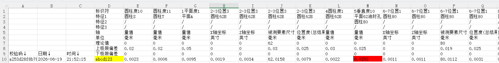  
  

## 使用

### 在测量测量中添加本工具

pcdmis-export-data（下称工具）是以 BASIC 脚本和外部命令的方式进行工作，在需要自动导出数据的测量程序中添加调用工具的命令即可，支持图形化操作。  
下载工具压缩包后，解压到一个固定目录，防止意外删除，双击运行 `pcdmis-export-data_win_amd64`  
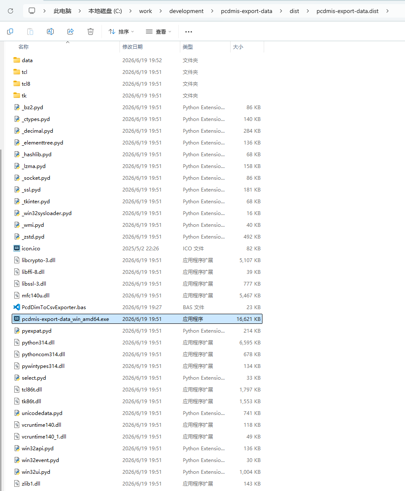  
打开 PC-DMIS，并打开需要添加自动导出数据的测量程序，在工具中点击`添加工具`  
如果勾选了“保存测量程序副本”，则会额外存储测量程序的副本  
如果勾选了“保存PDF报告”，则会自动保存PDF报告  
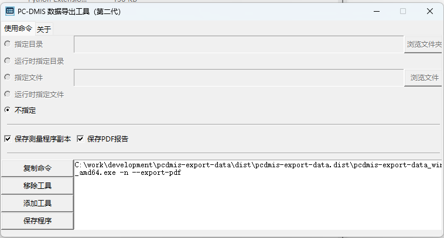  
可以在测量程序的末尾看到添加 1 个脚本命令和 1 个外部命令    
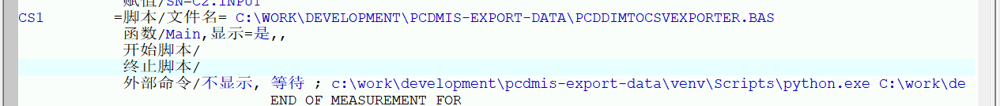  

接下来就可以进行正常测量了，当测量程序运行到末尾时就会自动调用工具执行，完成数据导出。  
导出的数据文件位于工具所在目录的 `data` 目录下  
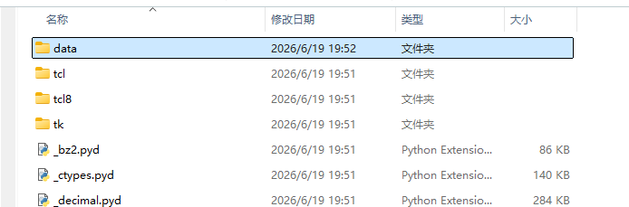  

`data` 目录下会根据测量程序的文件名创建文件夹，在文件夹下可以看到 Excel 文件以及测量程序的副本（如果勾选了“保存测量程序副本”）。  
Excel 文件命名为：测量程序文件名(PC-DMIS版本号).xlsx  
测量程序副本命名为：测量程序文件名(PC-DMIS版本号)(日期_时间)(序列号).PRG  
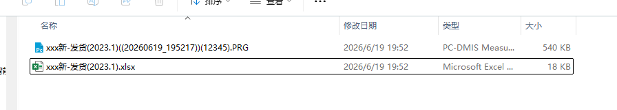  

如果勾选了“保存PDF报告”，则自动保存在PDF目录下  
PDF文件命名为：测量程序文件名(序列号)(日期_时间).pdf  
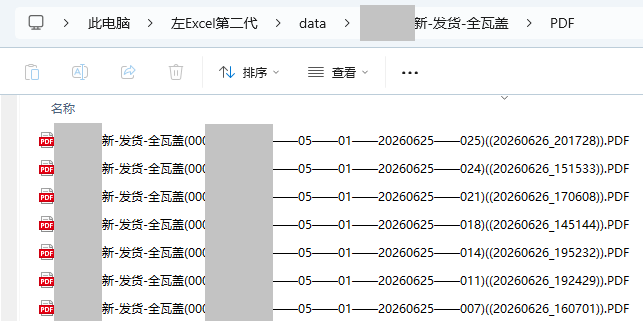

### 用于追溯产品的序列号

工具会优先使用测量程序中赋值的`SN`变量用作序列号，如果没有赋值`SN`变量，则使用测量程序头部的`序列号：`填写的内容  
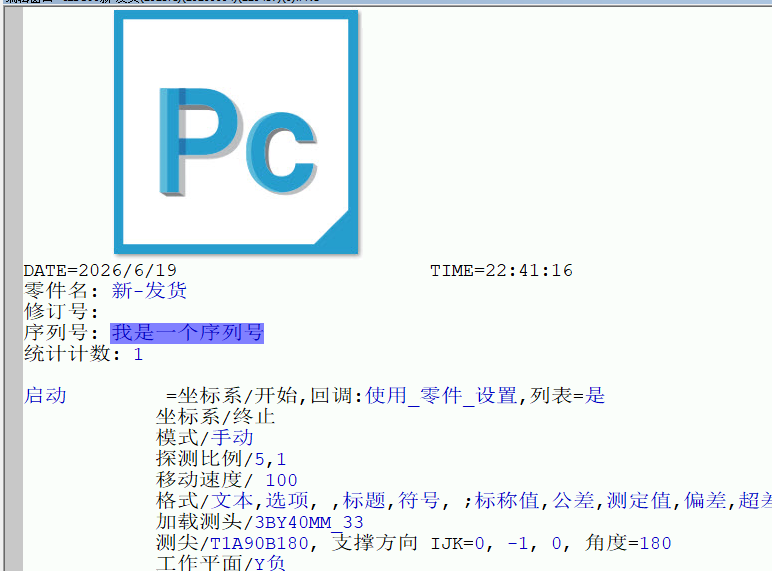  

考虑到检测员在运行测量程序前可能忘记填写序列号，因此设计了`SN`变量用于替代默认的序列号，可以在测量程序中添加一个注释用于提示检测员输入序列号，然后把注释读取到的检测员输入的内容赋值给`SN`变量。工具在检测到`SN`变量有输入内容后，会同步把`SN`值赋值给测量程序的序列号，由于默认 PDF 报告模板中序列号的字段也是用的测量程序的序列号值，这样相当于同步了 PDF 报告的序列号。  
添加`SN`输入提示的方法可参考：  

（1）插入注释  
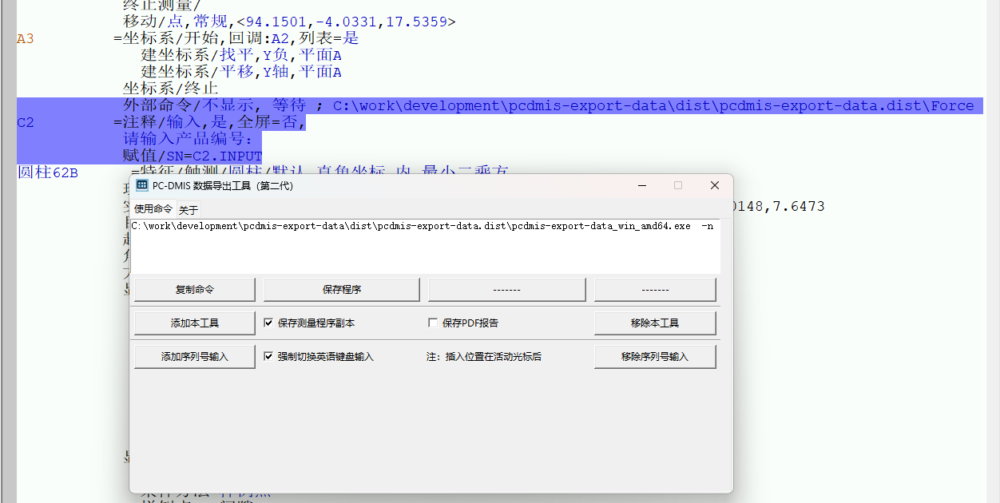  

（2）注释类型选输入，注释内容可填：“请输入产品序列号：”  
  

（3）这里插入的注释命令ID为 C3，注意记住这个ID，后面赋值使用  
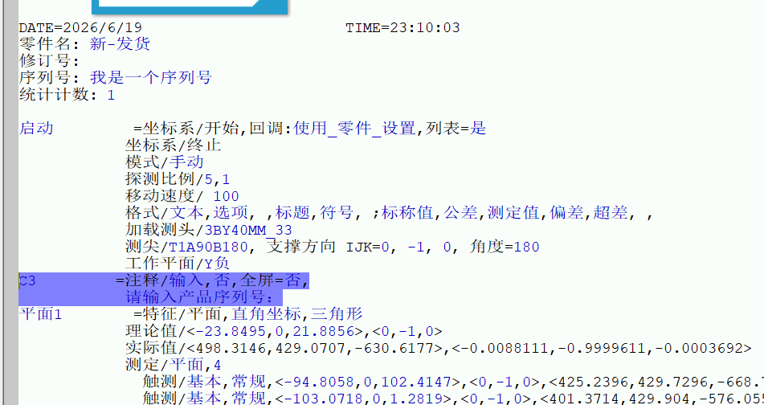  

（4）插入赋值  
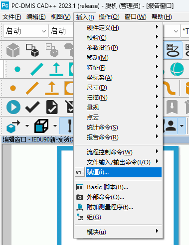  

（5）赋给：SN，赋自：C3.INPUT。如果前面的注释ID为C1，则填C1.INPUT  
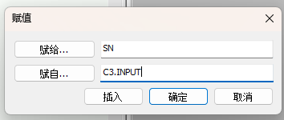  
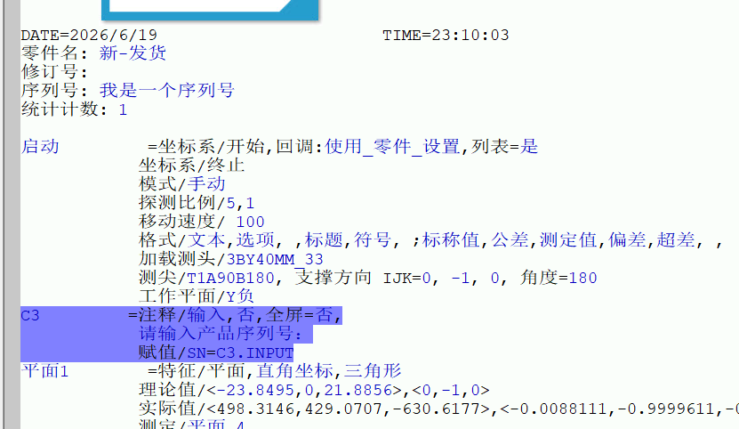  

测试效果：  
测量程序运行到注释位置，弹窗提示输入序列号  
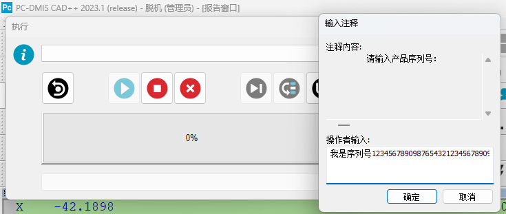  

测量程序运行结束后查看导出文件  
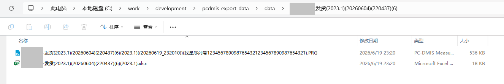  

每次测量的数据以行呈现。  
A 列为本次测量项目的校验码，检测内容修改则校验码会变化。即下次校验码有变则反映了检测内容有变更，则会重新写入表头，否则继续在下一行追加数据。  
B 列和 C 列为执行导出时电脑的日期和时间。  
D 列为本次测量填写的序列号，填充黄色代表有超差，全部合格填充绿色。  
后续列则为检测数据，填充红色代表超上差，填充品红代表超下差。  
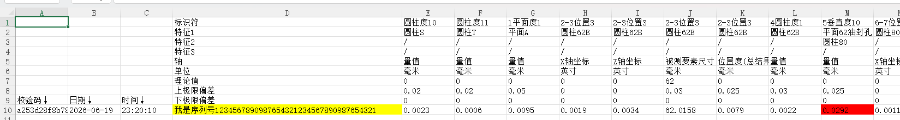  

### ForceEnMode 强制切换英语布局工具

2026/6/26  
我负责的一款产品在送检的时候，多次出现序列号手输错误的情况，在发货整理数据的时候就累苦了我。最近这个产品开始增量，客户又要求全检，部分尺寸又不能稳定满足，也只有按客户要求全检。因此收集三坐标数据和报告是必须要精简下来的工作，尽可能让程序完成，减少我的后期工作。  
我就通知了生产开始严格执行工序，在最终精加工工序前标刻追溯码，加工完每件送检的时候让三坐标检测员使用扫码枪录入追溯码，不再手输。  
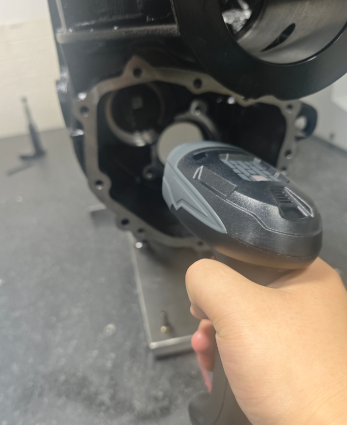  

今天是第二天试行扫码录入追溯码，我注意到一个特殊的问题。由于追溯码中带有下划线来分隔字段，电脑的输入法又经常是在拼音输入法下，扫码枪对于电脑就是一个键盘设备。这就出现了一个问题，拼音输入法下扫码输入的内容不会直接输入，而是发给了输入法，输入法再提供候选内容。结果下划线实际输入的时候变成了破折号“——”
  

晚上我就写了这个小工具，可以切换键盘布局到英语，把这个工具作为外部命令添加到测量程序中，并放在序列号提示输入的注释命令之前即可，明天上班我再添加到生产环境测试。  
注意要添加为“等待”，要这条命令执行完以后再继续。  
要用拼音输入法的时候，手动切换键盘布局可以使用快捷键`Win`+`Space`。  
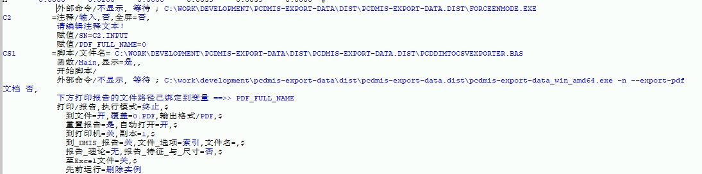  

## 开发历程

这个项目最初来自同事的提议，他们希望可以批量抓取数据，避免客户需要检测数据的时候花费大量人力去抄录。特别是对于新开发的项目，方便通过汇总数据监管过程。我从 2025 年 1 月中开始构思，当时距离春节还有十几天，主体写于春节几天，后续不断完善。    

---

2026.6.8  
Python 版性能已经难以提升了（受限于 COM 跨进程），我发现通过 PC-DMIS 内置的 BASIC 引擎执行数据读取性能非常好，至少百倍以上的差异。  
最近几天我在[学习 BASIC](https://blog.iyatt.com/?p=24885)，正在重构项目，将读取数据部分改为 BASIC 脚本实现，其它功能用 Python 完成即可。  
旧版纯 Python 方案可见[archive/python-original-version](https://github.com/IYATT-yx/pcdmis-export-data/tree/archive/python-original-version)。  

---

2026.6.19  
我负责的一个箱体产品应客户要求一直在执行三坐标全检，报告有十几页，原版本导出时间差不多要半分钟，效率过低，因此我进行了重构。  
今天端午节放假，我完成了重构。目前的方案是在测量程序中调用 BASIC 脚本提取数据写到 csv 文件，然后通过 Python 读取 csv 文件后进行数据清洗，最后写入 Excel 文件。这次重构主要是解决旧版方案中跨进程调用 COM 对象性能低下的问题，新方案通过 PC-DMIS 内部调用 BASIC 读取数据，性能提高百倍以上。  
上周二到上周六我在出差，BASIC 脚本部分就是在出差期间的晚上完成的，Python 部分是今天完成重构的。现在还需要持续测试，稳定性尚待验证。  
在实际使用中，都没用到指定导出文件/文件夹，暂时就没有重构这部分的功能，工具界面暂时先屏蔽掉了。  
  

## 测试环境

* Python 3.14.5（支持 Windows 10 及以上）  
* MSVC 平台工具集 v145（Visual Studio 2026）
* PC-DMIS 生产环境测试版本：2018 R1、2020 R1、2023.1

## 许可证

本项目采用 [MIT 许可证](LICENSE) 进行许可。  