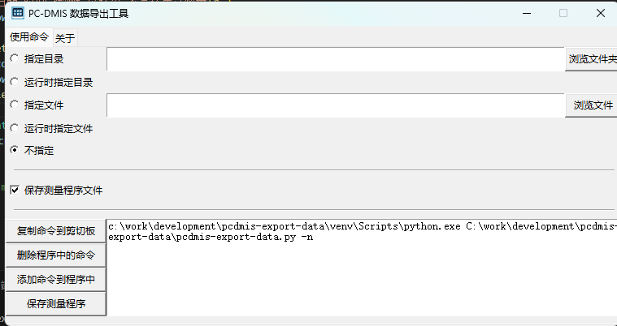

# pcdmis-export-data

PC-DMIS 数据导出工具  

功能：  
* 每次测量导出数据到 Excel 文件中，一次测量的数据以一行呈现。A列为测量特征，与评价对象和本工具版本有关，在涉及评价对象修改以及工具更新版本时，实现重新输出表头，用户不用关注。B列为序列号，在开始测量前在测量程序头部的序列号处输入，用于追溯数据。C列和D列，分别为执行本工具的日期和时间。后续列即为测量数据。  
* 每次执行本工具导出数据的时候，会自动触发保存当前测量程序，然后保存一份副本到导出的Excel文件的同目录下，副本命名为：测量程序名(PC-DMIS版本)(日期)(时间)(序列号).PRG  
* 如果 PC-DMIS 同时打开了多个测量程序，那么执行本工具的时候会优先连接到处于联机状态的测量程序（即正在使用三坐标设备检测的程序）进行数据导出。如果没有处于联机状态的程序，才会连接当前处于前台显示的测量程序。三坐标检测员有可能会一边检测一边编辑其它程序，这样可以保证导出数据是来源于正在测量的程序。  

使用：
* 工作方式：在运行 PC-DMIS 且打开测量程序的情况下，点击“添加命令到程序中”，就会把右侧显示的命令以外部命令的方式添加到测量程序的末尾，这样每次测量程序运行完，结尾就会通过外部命令执行本工具。本工具执行导出的路径是受参数控制的，可以通过调整上面4个选项自动生成命令参数。
* 选项：①指定目录：指定目录后，导出的 Excel 文件就会保存在指定的目录下，文件名为：测量程序名(PC-DMIS版本).xlsx；②运行时指定目录：在每次执行本工具准备导出数据的时候，会弹出文件对话框，选择目录后进行导出；③指定文件：指定Excel文件名，数据会直接导出到这个文件中；④运行时指定文件：每次执行本工具的时候会弹出文件对话框，选择要导出到的Excel文件后进行导出；⑤不指定：此时导出的目录位于本工具目录下的 data 文件夹下，文件名为：测量程序名(PC-DMIS版本).xlsx。
* 其它按钮：①复制命令到剪切板：会复制右侧的命令到剪切板，可以粘粘到 cmd 或 powershell 中执行；②删除程序中的命令：会删除测量程序中调用本工具的外部命令，涉及修改命令参数的时候可以通过这个按钮快速删除以前的，以便再添加新的；③保存测量程序：点击这个按钮会触发PC-DMIS保存当前处于前台打开的测量程序。
* 注：在图形界面进行的操作都是对当前PC-DMIS打开的前台程序生效，而不考虑是否是联机程序。  

## 测试环境

* Python 3.13.1（支持 Windows 8 及以上）  
* PC-DMIS 版本（正在测试）：2018 R1、2019 R2、2023.1、2023.2

目前我这边实际生产中经常测试使用的是 2018 R1，我调试验证使用的是 2019 R2 和 2023.2，其它很少测试。  
Release 提供的打包版程序受限于 Python 版本，最低只支持到 Windows 8，要支持 Windows 7，使用的 Python 版本不能高于 3.8，这版本着实有点老了，我也没有精力单独去测试这个版本的。公司里的三坐标电脑都是 Windows 10 的，我自己电脑用的 Windows 11 的，没有确实需要 Windows 7 的环境，我也就不会去测试了。