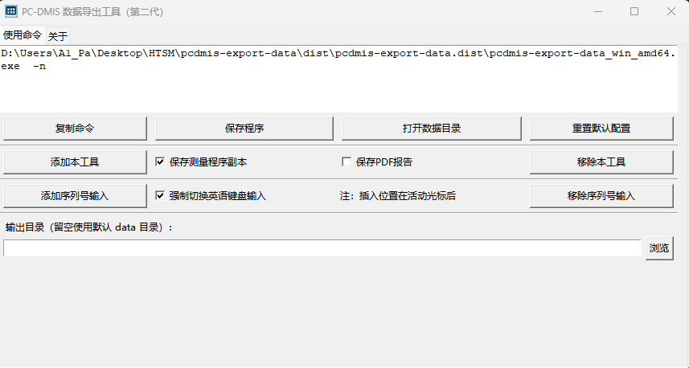

# 开发历程

这个项目最初来自同事的提议，他们希望可以批量抓取数据，避免客户需要检测数据的时候花费大量人力去抄录。特别是对于新开发的项目，方便通过汇总数据监管过程。我从 2025 年 1 月中开始构思，当时距离春节还有十几天，主体写于春节几天，后续不断完善。

---

2026.6.8  
Python 版性能已经难以提升了（受限于 COM 跨进程），我发现通过 PC-DMIS 内置的 BASIC 引擎执行数据读取性能非常好，至少百倍以上的差异。  
最近几天我在[学习 BASIC](https://blog.iyatt.com/?p=24885)，正在重构项目，将读取数据部分改为 BASIC 脚本实现，其它功能用 Python 完成即可。  
旧版纯 Python 方案可见[archive/python-original-version](https://github.com/IYATT-yx/pcdmis-export-data/tree/archive/python-original-version)。

---

2026.6.19  
我负责的一个箱体产品应客户要求一直在执行三坐标全检，报告有十几页，原版本导出时间差不多要半分钟，效率过低，因此我进行了重构。  
今天端午节放假，我完成了重构。目前的方案是在测量程序中调用 BASIC 脚本提取数据写到 csv 文件，然后通过 Python 读取 csv 文件后进行数据清洗，最后写入 Excel 文件。这次重构主要是解决旧版方案中跨进程调用 COM 对象性能低下的问题，新方案通过 PC-DMIS 内部调用 BASIC 读取数据，性能提高百倍以上。  
上周二到上周六我在出差，BASIC 脚本部分就是在出差期间的晚上完成的，Python 部分是今天完成重构的。现在还需要持续测试，稳定性尚待验证。  

---

2026.7.1

- 窗口宽度从 756px 增大到 860px，支持手动拖拽调整大小，解决部分内容显示不全的问题。
- 新增 `-o` / `--output` 参数，支持在命令行指定数据输出目录。UI 界面同步增加输出目录选择行，可浏览选择目录或留空使用默认 `data` 目录。
- 替换占位按钮为「打开数据目录」和「重置默认配置」两个功能按钮。
- 构建脚本优化：修复 venv 激活兼容性问题，ForceEnMode.exe 改为自动编译（利用 Nuitka 缓存的 gcc，无需 Visual Studio），支持 Nuitka 自定义缓存目录。
- 注意：命令行参数需使用双横线格式 `--no-prog` / `--export-pdf`，或短参数 `-np` / `-ep`。

