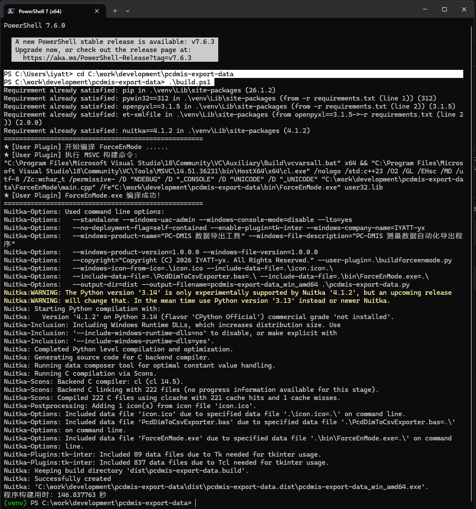
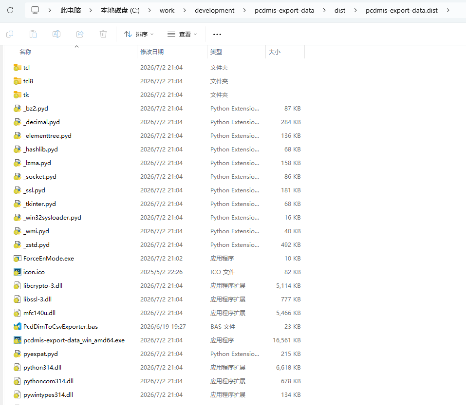

# 打包说明

## 环境

以下为作者使用的打包环境，仅供参考：  
* Windows 11（至少要 Windows 10）  
* [Python](https://www.python.org/downloads/) 3.14.5
* [PowerShell](https://github.com/powershell/powershell/releases) 7.6.0

* [Visual Studio 2026 生成工具](https://learn.microsoft.com/zh-cn/visualstudio/releases/2026/release-history#installation-of-visual-studio)  

注：本工具使用 Nuitka 打包为可执行文件，Nuitka 会将代码转译为 C++，再调用三方编译器进行编译。从 Python 3.13 开始，Nuitka 不再支持 mingw64（旧版本时，是 Nuitka 在给 mingw64 打补丁支持。Python 3.13 进行架构大改，Nuitka 团队应该是没有精力去打补丁了），且考虑到 Windows 版 Python 原生就是用 MSVC 生成工具构建的，因此建议使用 MSVC 生成工具进行编译，以获得最佳的兼容性和稳定性。  

## 打包

首次时，以管理员身份打开 PowerShell 7 执行下面命令允许运行脚本  
```powershell
Set-Executionpolicy RemoteSigned
```

打开 PowerShell 7，切换到项目目录下，执行下面命令打包  
```powershell
.\build.ps1
```
  


打包后的软件位于项目下 dist 目录中，软件文件夹为 pcdmis-export-data.dist  
  